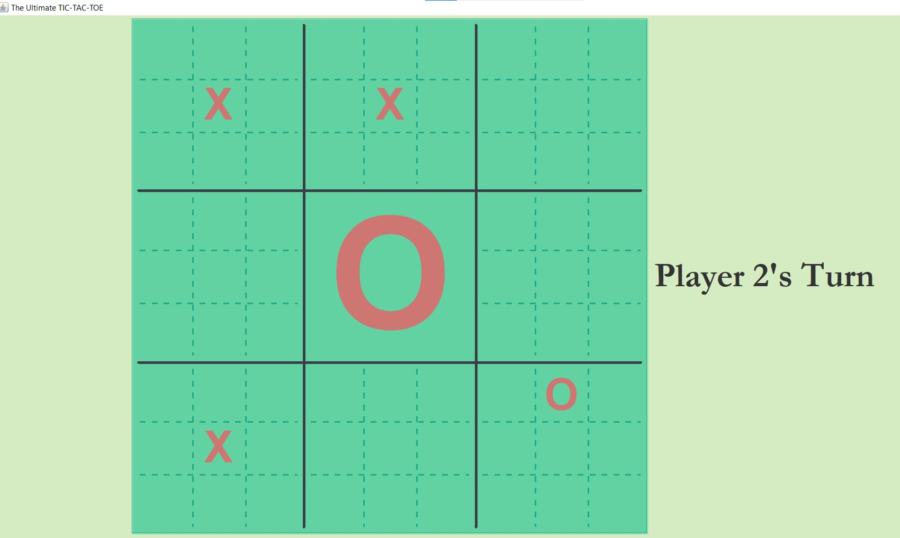

# A java client ultimate tic-tac-toe client

## A simple java front end client for players that uses web sockets to communicate with server.
 

 
Ultimate tic-tac-toe is project on web sockets that implements the recursive version of the classic tic-tac-toe exploring websockets as the mode for inter-process communication. This is the front end client for the players in the same.
 
 

